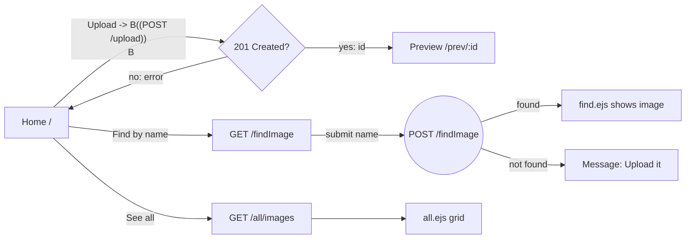
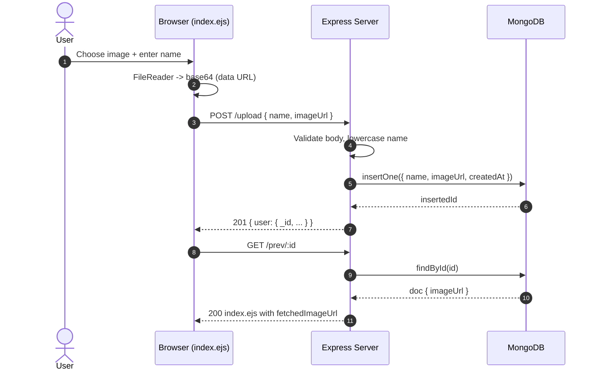
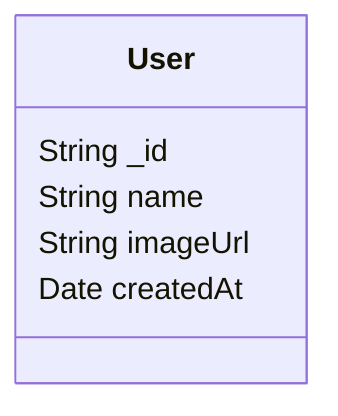
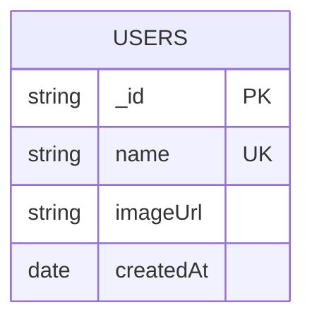

# 📸 ShadowX Image Uploader

<div align="center">
  
  
  <div>
    
    
    
  </div>
  
  <div style="margin-top: 10px;">
    
    
    
    
    
  </div>
</div>

<p align="center">
  <a href="https://shadowx-image-uploader.onrender.com/" target="_blank">
    
  </a>
  <br />
  <small>Hosted on Render • Auto-scaled • Public demo</small>
</p>

---

## 🚀 Overview

**ShadowX Image Uploader** is a minimal, production-ready web app to upload an image (as a data URL), store it with a name in MongoDB, and instantly fetch or browse it later. Built with Node.js, Express, MongoDB (Mongoose), and EJS views styled via Tailwind CDN.

- 🔼 Upload an image with a name
- 🔎 Find an image by name
- 🖼️ Preview a just-uploaded image via a shareable URL
- 🗂️ Browse all uploaded images

---

## 🛠️ Tech Stack

<div align="center">

| Frontend | Backend | Database | Tools |
|----------|---------|----------|-------|
|  |  |  |  |
|  |  |  |  |

</div>

---

## 📂 Project Structure

```
📦 ImageUpload/
├── app.js                 # Express app, routes, server bootstrap
├── db/
│   └── db.js              # Mongoose connection (uses MONGO_URI)
├── model/
│   └── user.js            # Mongoose model: { name, imageUrl, createdAt }
├── public/
│   └── images/favicon/    # Static assets (favicon)
├── views/
│   ├── index.ejs          # Home: upload form + preview page
│   ├── find.ejs           # Find by name form + result
│   └── all.ejs            # Grid of all uploaded images
├── package.json
└── README.md
```

---

## 🔗 Pages & Flow

- **Home (`GET /`)**: Renders `index.ejs` with upload form. After successful upload, redirects to `GET /prev/:id` to show the saved image.
- **Preview (`GET /prev/:id`)**: Fetches the uploaded document by id and renders `index.ejs` in preview mode with the `fetchedImageUrl`.
- **Find by Name**
  - `GET /findImage`: Renders `find.ejs` with a search form
  - `POST /findImage`: Finds by `name` (lowercased) and renders `find.ejs` with the image or a friendly message
- **All Images (`GET /all/images`)**: Renders `all.ejs` to show all uploaded images in a responsive grid



---

## 🧠 How It Works

1. User selects a file; browser `FileReader` converts it to a Base64 Data URL.
2. App builds `{ name, imageUrl }` payload and sends it to `POST /upload`.
3. Server validates inputs, normalizes `name`, ensures uniqueness, stores document.
4. Server returns the created document; client redirects to `/prev/:id` to show it.



---

## 🧩 API & Routes

| **Method** | **Path**         | **Purpose**                       | **Request Body**                 | **Response (success)**                     |
|------------|------------------|-----------------------------------|----------------------------------|--------------------------------------------|
| GET        | `/`              | Render home (upload form)         | -                                | HTML                                       |
| GET        | `/prev/:id`      | Show preview of uploaded image    | -                                | HTML (index.ejs with `fetchedImageUrl`)    |
| POST       | `/upload`        | Create image document             | `{ name, imageUrl }`             | `201 { message, user }`                    |
| GET        | `/findImage`     | Render find form                  | -                                | HTML                                       |
| POST       | `/findImage`     | Find by name and render result    | `{ name }`                        | HTML (find.ejs with image or message)      |
| GET        | `/all/images`    | Render grid of all images         | -                                | HTML (all.ejs list)                        |

- **Validation & Errors**
  - 400: Missing `name` or `imageUrl` on upload; missing `name` on find
  - 400: Duplicate `name` on upload (user already exists)
  - 500: Generic server/database errors

---

## 🗄️ Database Model

```js
// model/user.js
{
  name: String,        // required, unique by application logic (lowercased)
  imageUrl: String,    // required (Base64 data URL or remote URL)
  createdAt: Date      // default: now
}
```



### Mongo Collection, Indexes, and Constraints

- Collection: `users`
- Suggested indexes:
  - `{ name: 1 }` unique: true (enforce uniqueness at DB level)
  - `{ createdAt: -1 }` (optimize recent listing)
- Size considerations: base64 images increase document size by ~33%; consider moving to object storage in future.

### Example Document

```json
{
  "_id": "66fa0e6b5c9f9a0012e7abcd",
  "name": "lucky",
  "imageUrl": "data:image/png;base64,iVBORw0KGgoAAA...",
  "createdAt": "2025-09-14T10:21:38.221Z"
}
```

### ER Perspective (single-collection)



- Connection uses `MONGO_URI` via `db/db.js` with `mongoose.connect`.

---

## 🌐 Live Demo

<div align="center">
  <a href="https://shadowx-image-uploader.onrender.com/" target="_blank">
    
  </a>
  <br/>
  <sub>If the instance is sleeping, please wait a few seconds for cold start.</sub>
</div>

---

## ⚙️ Installation & Setup

### Prerequisites
```bash
Node.js 18+
MongoDB Atlas or local MongoDB
```

### Quick Start
```bash
# 1) Clone
git clone <repo-url>
cd ImageUpload

# 2) Install deps
npm install

# 3) Configure env
# Create .env in project root with:
# MONGO_URI=mongodb+srv://<user>:<pass>@<cluster>/<db>?retryWrites=true&w=majority
# PORT=3000

# 4) Run
npm start
# App on http://localhost:3000
```

---

## 🖥️ Usage Guide

1) Open the Home page `/`.
2) Enter a unique name and choose an image file.
3) Click Upload. You will be redirected to `/prev/:id` to preview the stored image.
4) Use `/findImage` to fetch by name.
5) Visit `/all/images` to browse everything.

---

## 🛡️ Security Notes

- Uploaded content is stored as base64 in MongoDB; size is limited via JSON/body parser (`10mb`).
- Name uniqueness enforced in application (one image per name).
- Static assets served from `public/`.

---

## 🧭 Roadmap / Enhancements

- Persist files to object storage (e.g., S3/Cloudinary) vs base64 in DB
- Add delete/update image endpoints
- Add pagination to `/all/images`
- Add server-side validation for image MIME/size
- Add rate limiting & basic auth for admin operations

---

## 👨‍💻 Developer

<div align="center">
  
  
  <p><em>Computer Science Student & Aspiring Software Developer</em></p>
  
  <div style="margin: 20px 0;">
    <a href="https://lucky-longre.onrender.com/" target="_blank">
      
    </a>
    <a href="mailto:officialluckylongre@gmail.com">
      
    </a>
    <a href="https://www.linkedin.com/in/lucky-longre/" target="_blank">
      
    </a>
  </div>
  
  <p>
    
    
    
  </p>
</div>

### 💼 Technical Expertise

<div align="center">

| **Frontend Technologies** | **Backend Technologies** | **Database & Tools** |
|--------------------------|-------------------------|---------------------|
| HTML5, CSS3, JavaScript, Tailwind | Node.js, Express.js, REST APIs | MongoDB, Mongoose |
| EJS, Responsive Design | Authentication Systems | Git, GitHub |
| Basic jQuery/AJAX | File Upload Systems | Postman, VS Code |

</div>

### 🚀 Development Philosophy

- **Problem-Solving First**: Understand the user problem before writing code.
- **User-Centric Design**: Keep flows simple, fast, and accessible.
- **Security-Minded**: Validate inputs and protect data by default.
- **Performance Focused**: Favor efficient, maintainable implementations.
- **Continuous Learning**: Iterate with feedback and new best practices.

### 📈 Goals

- **Short-term**: Build and ship practical, production-ready web apps.
- **Medium-term**: Deepen expertise in scalable backends and cloud storage/CDNs.
- **Long-term**: Lead full-stack projects and mentor budding developers.

---

<p align="center">
  
  <br />
  <strong>ShadowX Image Uploader</strong> — Simple, fast, and ready to share.
</p>
